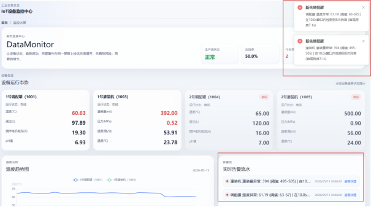
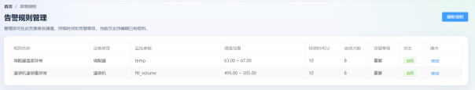
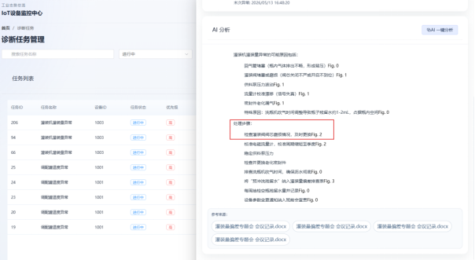
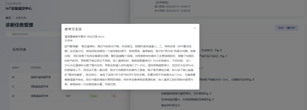
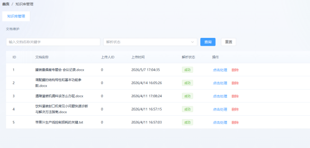
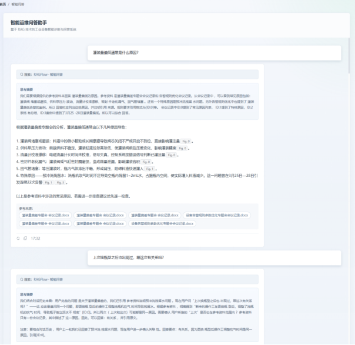

# 基于RAG的工业设备智能运维平台
> 
> 解决了工业运维中告警后的决策问题，根据过往会议记录与专题报告，构建故障知识库。AI检索知识库进行故障诊断，辅助运维人员进行决策。

## 项目背景
当前工业故障诊断存在如下问题：
- 设备告警很多，但人工排查效率低
- 历史知识分散在文档、会议纪要、报告里，难以快速检索
- 新手运维人员缺少经验，诊断依赖老员工
- 单纯阈值告警容易误报，缺少上下文判断

过去的工业运维平台大多停留在告警展示和阈值监控阶段，只能告诉运维人员哪里出问题了，但很难进一步回答为什么会出问题，应该如何处理，是否有相似案例可参考。本项目在此基础上引入了知识库检索和大模型分析能力，把分散在文档中的经验沉淀下来，并结合实时监控数据进行辅助诊断，为告警后的决策提供更准确、更可解释的解决方案，验证了 RAG 在工业运维场景中的落地可行性。

## 项目技术栈

### 前端
- `Vue 3` + `TypeScript`：构建页面组件与业务逻辑，提升开发效率与类型安全。
- `Vite`：作为前端构建工具，提供快速冷启动与热更新能力。
- `Element Plus`：用于管理后台常用的表单、弹窗、表格、布局等组件。
- `Pinia`：统一管理全局状态，如用户信息、告警任务、对话记录等。
- `Vue Router`：负责多页面路由与权限页面跳转。
- `ECharts`：用于展示设备温度趋势、监控曲线等可视化图表。
- `Axios`：封装 HTTP 请求，连接前后端业务接口。
- `markdown-it`：渲染 AI 诊断结果、知识文档等富文本内容。

### 后端与服务
- `WebSocket` + `Express` + `TypeScript`：构建设备数据推送、业务接口与管理服务。
- `MySQL`：存储设备数据、告警规则、诊断任务、用户与历史记录等结构化信息。
- `ws`：实现前后端长连接通信，支持监控大屏实时刷新。
- `bcrypt` + `jsonwebtoken`：用于用户认证、密码加密与登录态管理。
- `multer`：支持文档上传与知识库文件导入。
- `exceljs`：用于导出或处理表格类数据。

### AI 与知识库
- `RAGFlow`：用于知识库构建、文档解析、分块、向量化与混合检索。
- `DeepSeek` 大模型：用于智能诊断、问答生成与流式分析输出。

## 系统架构

平台整体采用“前端展示层 + 业务服务层 + AI 知识层 + 数据存储层”的分层架构：

1. **前端展示层**
   - 负责监控大屏、告警规则配置、诊断任务管理、智能问答等页面展示。
   - 通过 `WebSocket` 接收设备实时数据，通过 `Axios` 调用业务接口。
   - 使用 `ECharts` 和 `Element Plus` 完成数据展示与交互。

2. **业务服务层**
   - 负责设备数据接入、异常检测、告警判定、任务流转、用户认证等核心业务。
   - 对实时数据进行阈值判断、持续次数判断和时间窗口判断，减少瞬时毛刺误报。
   - 将异常事件推送给前端，同时生成待确认的诊断任务。

3. **AI 知识层**
   - 负责知识库文档管理、解析、分块、向量检索和大模型推理。
   - 诊断模块与问答模块共享同一套 RAG 检索能力，保证知识复用。
   - 支持流式输出结构化诊断结果，并展示引用来源，增强可解释性。

4. **数据存储层**
   - MySQL 存储设备状态、告警规则、用户信息、诊断任务与历史记录。
   - 向量数据库存储文档向量与检索索引，支撑语义召回。
   - 文档原始文件、解析结果与日志信息用于知识追溯和后续分析。

### 业务闭环
- 设备数据进入系统后，后端实时计算状态并通过 `WebSocket` 推送到前端大屏。
- 当数据满足连续超限 + 时间窗口条件时，系统自动生成告警和诊断任务。
- 运维人员在任务详情中触发 AI 分析，系统先做 RAG 检索，再由大模型生成结构化诊断结论。
- 问答模块复用同一知识库，帮助运维人员随时查询故障原因与处理建议。

## 功能介绍
> [!NOTE]
> 【效果视频】https://www.bilibili.com/video/BV1XaE96REyL?vd_source=b98adfd85cd900113bf1a71861ce1498
>
> 以常见的工厂误报现象为例，通过模拟误报场景，平台自动检测出异常建立诊断任务，随后用户点击诊断任务ai结合知识库进行诊断，给出来自于过往会议记录的文本块，并给出修改告警规则的建议，用户修改后平台不告警，任务结束。

### 监控与告警

- 实时监控
  监控与告警模块基于WebSocket全双工通信，前端大屏与后端建立长连接，设备数据入库后主动推送至客户端，实现设备状态卡片、不同设备温度趋势图的秒级动态刷新，避免传统轮询的网络开销与延迟。

- 告警处理
  平台会对异常进行区分，如果只是单阈值超限，前端设备卡片只是把数据渲染为红色。如果持续异常，平台则自动生成诊断任务并推送给智能诊断模块，且初始状态为待确认。形成了感知到响应的完整链路，解决了误报频繁的痛点。

- 告警规则
  运维人员可以进行告警规则配置，调整阈值范围，持续时间和持续次数。
  设计了连续超限次数+时间窗口双重确认机制作为告警判定。数据进入异常引擎依次进行阈值判定，持续次数，持续时间，这些数值来源告警规则表。
  以灌装量为例，管理员可配置下限495mL、连续超限20次、时间窗口30秒，仅当20次异常的首尾时间差≤30秒时才触发告警任务，否则仅标记数据状态为预警，设备卡片显示红色但不生成任务，有效过滤瞬时毛刺。

  大屏界面：

​    规则配置界面：

### 智能诊断
- 知识库构建
  智能诊断模块采用RAGFlow框架构建故障知识库将维修手册、会议记录等非结构化文档进行分块，向量化之后存入向量数据库。
  分块策略使用RAGFlow框架的父子分层分块策略，父块大小约 1000 token，保留完整逻辑段落；子块大小约512 token，用于精准匹配用户查询。查询时先通过子块定位，再向上返回父块，兼顾检索精度与语义完整性。
  运维人员可以使用平台进行知识库管理，包括上传文档，进行文档解析，删除文档等操作。

- RAG检索
  检索策略为向量检索与RAGFlow框架的自动关键词提取与自动问题生成的混合检索。RAGFlow框架使用聊天模型在文档解析分块时自动提取4个关键词提取与2个问题。与父子分块策略搭配使用大幅提高了检索速率。

- 提示词设计
  回复质量主要受两个因素影响：一是检索阶段能否召回与当前异常真正相关的知识片段，二是大模型能否严格依据这些片段进行推理而非依赖自身预训练知识。为引导大模型生成结构化、可追溯的诊断报告，设计了如右图的提示词模板

- 诊断任务管理
  运维人员可以进行诊断任务管理，平台自动建立诊断任务后，初始状态为待确认。可以在任务详情页点击确认，状态流转为进行中。在任务详情页还可以点击AI一键分析，平台采用流式输出，后端返回结构化JSON文本表示思考，正文，来源文本块，前端可以点击查看参考文本块，有效解决了有效解决了经验依赖强和大模型幻觉这两个痛点。

  诊断任务ai分析：

召回文本块：

知识库管理：

### 智能问答
智能问答模块与诊断模块共享RAG检索与DeepSeek能力，并增加多轮对话上下文管理功能。运维人员可用自然语言提问，如“灌装量偏低是什么原因？”。每轮回答末尾列出引用的知识文档名称，知识不足时模型会如实说明而非编造。模块还提供历史对话记录查看与检索功能，方便知识回溯。这解决了“知识难复用”的痛点，将分散在老师傅头脑或散落文档中的经验转化为可交互、可搜索的数字资产。

智能问答效果：

## 项目亮点
### ai回答的准确性和速率
平台对于ai回答的准确性和速率需要高要求，由于准确性的偏差主要来源于ai幻觉，所以我在系统提示词对ai进行强制约束，定义变量knowledge作为参考来源，回答必需根据来源且标注，这里的来源主要指的是召回文本块。如果没有检索到可以根据大模型内部现有知识进行回答，但必须标注是根据自身回答而不是来源知识库。当然还有一部分来源于检索失败，这里我用设立文本块关键词和预设问题进行解决，或者调整相似度阈值。
速率的主要影响因素是检索速率以及ai识别并分析参考来源的速率。对于前者设置混合检索策略，平台的检索策略为30%向量检索和70%关键词匹配，关键词检索大幅提高检索速率。ai识别并分析参考来源的速率主要指的是ai分析无关文本块所花费的时间，比如召回了不是很匹配的文本块ai就会多花时间，这个问题也通过关键词解决了。

